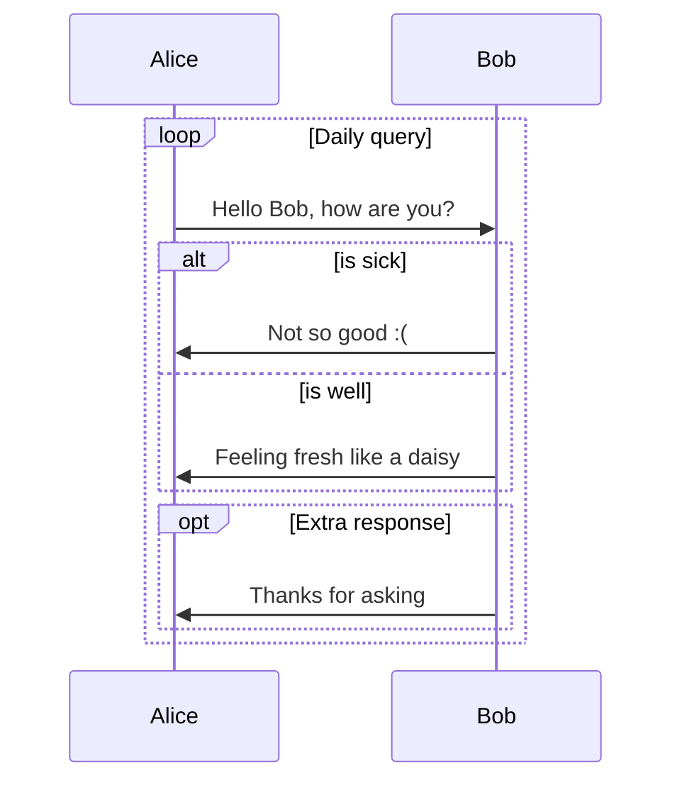
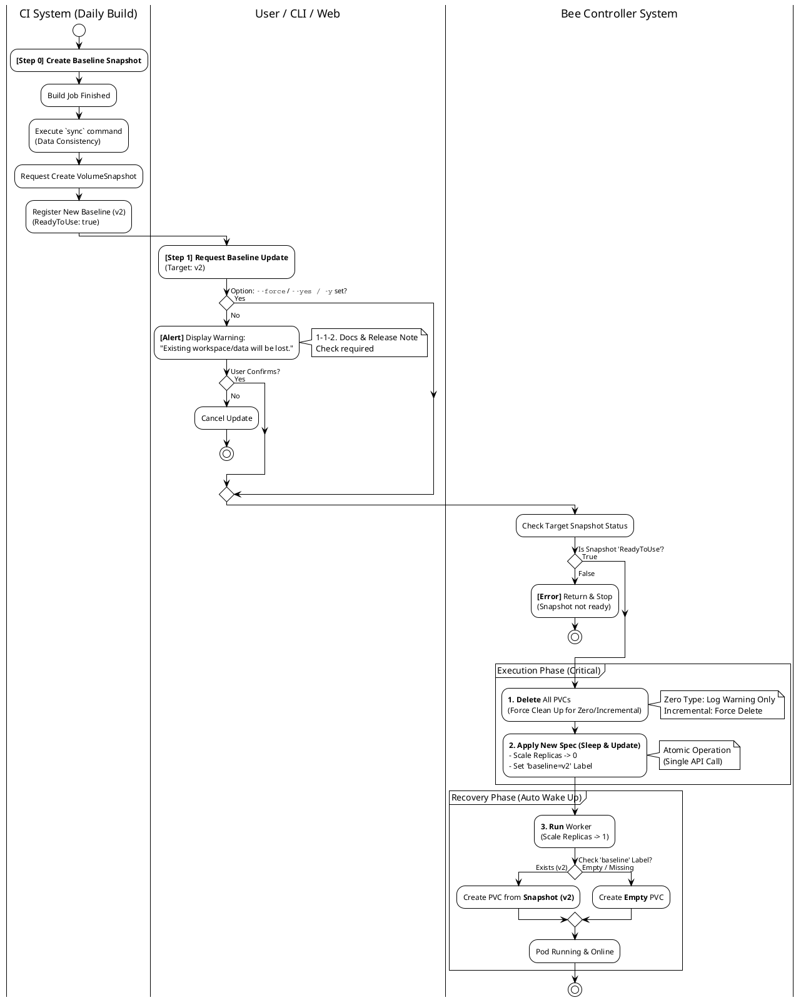

```mermaid
sequenceDiagram
    loop Daily query
        Alice->>Bob: Hello Bob, how are you?
        alt is sick
            Bob->>Alice: Not so good :(
        else is well
            Bob->>Alice: Feeling fresh like a daisy
        end

        opt Extra response
            Bob->>Alice: Thanks for asking
        end
    end

```

```plantuml
@startuml
' 스타일 설정
!theme plain
skinparam conditionStyle diamond
skinparam activity {
  BackgroundColor<<Critical>> IndianRed
  FontColor<<Critical>> White
  BorderColor<<Critical>> DarkRed
}

|CI System (Daily Build)|
start
:<b>[Step 0] Create Baseline Snapshot</b>;
:Build Job Finished;
:Execute `sync` command\n(Data Consistency);
:Request Create VolumeSnapshot;
:Register New Baseline (v2)\n(ReadyToUse: true);

|User / CLI / Web|
:<b>[Step 1] Request Baseline Update</b>\n(Target: v2);

' 1-1. 자동화 옵션 확인
if (Option: ""--force"" / ""--yes / -y"" set?) then (No)
    :<b>[Alert]</b> Display Warning:\n"Existing workspace/data will be lost.";
    note right
        1-1-2. Docs & Release Note
        Check required
    end note
    
    ' 1-1. 사용자 확인
    if (User Confirms?) then (No)
        :Cancel Update;
        stop
    else (Yes)
    endif
else (Yes)
endif

|Bee Controller System|
' 1-2. 스냅샷 상태 확인
:Check Target Snapshot Status;

if (Is Snapshot 'ReadyToUse'?) then (False)
    :<b>[Error]</b> Return & Stop\n(Snapshot not ready);
    stop
else (True)
endif

' 1-3 ~ 1-6. 실행 단계 (Critical Section)
partition "Execution Phase (Critical)" {
    ' 순서 변경: PVC 삭제 -> (Sleep + Update Labels 통합)
    :<b>1. Delete</b> All PVCs\n(Force Clean Up for Zero/Incremental);
    note right
        Zero Type: Log Warning Only
        Incremental: Force Delete
    end note
    
    :<b>2. Apply New Spec (Sleep & Update)</b>\n- Scale Replicas -> 0\n- Set 'baseline=v2' Label;
    note right
        Atomic Operation
        (Single API Call)
    end note
}

' 2. 복구 및 실행 단계 (Run Logic)
partition "Recovery Phase (Auto Wake Up)" {
    :<b>3. Run</b> Worker\n(Scale Replicas -> 1);
    
    ' 2-1 ~ 2-2. PVC 생성 로직
    if (Check 'baseline' Label?) then (Exists (v2))
        :Create PVC from <b>Snapshot (v2)</b>;
    else (Empty / Missing)
        :Create <b>Empty</b> PVC;
    endif
    
    :Pod Running & Online;
}

stop
@enduml
```
